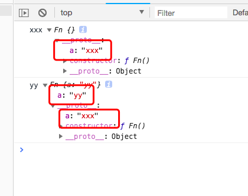

#原型

## 1.prototype:原型，每个函数都有prototype属性，默认指向一个Object空对象（称为：原型对象）
  ```javascript
    function Foo() {
    }
    console.log(Foo.prototype)   //constructor  __proto__
  ```
  
  这里为什么要说是空对象，明明看到有constructor、__proto__两个属性，其实是这个Object对象中没有我们所需要的属性，当然可以去向原型中添加我们需要属性或者方法。

## 2.给原型对象添加属性(一般都是方法)
  ````javascript
    Foo.prototype.method=function () {
        console.log("method()")
    }
    console.log(Foo.prototype) 
  ````
  此时在原型中可以看到method属性已经添加到Foo()中去了。
  
  现在我们通过创建实例去访问我们刚才添加的方法
  ```javascript
    var fun=new Foo()
    fun.method()   // 可以看到返回的是method()
  ```
  
  由此可以看到构造函数跟原型对象是相互引用的关系。

## 3.显示原型和隐式原型
  每个函数function都有一个prototype，即显示原型(属性);
  每一个实例对象都有一个__proto__ 称为隐式原型（属性）
  我们继续之前的构造函数：
  ```javascript
    var fun=new Foo() 
    console.log(fun.__proto__)
    //对象的隐式原型的值为其对应构造函数的显示原型的值
    console.log(Foo.prototype===fun.__proto__)//true
    fun.method()   // 可以看到返回的是method()
   ```
   可以看到对象的__proto__属性在创建对象时是自动添加的，默认值为构造函数的prototype属性值。

## 4.constructor
  在原型对象中有一个属性constructor，当我们自定义构造函数之后，其原型对象只会默认取得constructor值，可以通过该属性判断出实例是由哪个构造函数创建的。
  ```javascript
    console.log(fun.prototype.constructor===Foo)  //true
  ```
  那么构造函数的原型对象是由什么来创建的呢？
  我们去构造函数中寻找：
  ```javascript
    Foo.prototype.__proto__.constructor // ƒ Object() { [native code] }
  ```
  这样一来可以看到构造函数原型链的其他方法，原来是从Object 上继承来的。
  这里的Object本来就存在，此时我们可以追溯到它的原型链。


#原型链

原型链(本质上就隐式原型链，是用来查找对象的。)
  
    在创建函数之前，已经就有了一个Object函数对象，js在加载引擎的时候首先会把这个内置的函数加载进来，然后在去执行我们的一些方法，访问一个对象的属性时，先从自身属性中查找，找到返回，如果没有，再沿着__proto__这条链上查找，找到返回，如果最终没找到，返回undefined。
    
##注意事项：

1. 函数的显示原型指向的对象默认是Object实例对象（但是Object不满足）
```javascript
console.log(Fn.prototype instanceof Object)  //true
    console.log(Object.prototype instanceof Object) //false
    console.log(Function.prototype instanceof Object) //true
```

2.所有函数都是Function的实例
```javascript
    console.log(Function.__proto__===Function.prototype)  //true
```

3.Object的原型对象是原型链的尽头
```javascript
    console.log(Object.prototype.__proto__) //null
```
4.（1）读取对象的属性值时，会自动到原型链中查找
  （2）设置对象的属性时，不会查找原型链，如果当前对象中没有此属性，直击添加属性并设置其值
   (3)方法一定定义在原型中，属性一般通过构造函数定义在对象本身上，
```javascript
function Fn() {
}

Fn.prototype.a = 'xxx';
var fn1 = new Fn()
console.log(fn1.a, fn1)//xxx
var fn2 = new Fn()
fn2.a = 'yy'
console.log(fn2.a, fn2)  //yy
```
  

  一般情况下，我们会将属性直接添加在函数中，
  ```javascript
 
    function Person(name, age) {
        this.name = name;
        this.age = age
    }

    Person.prototype.setName=function (name) {
        this.name = name
    }

    var p1 = new Person('tom', 12)
    p1.setName('bob')
    console.log(p1)


    var p2 = new Person('errol', 12)
    p2.setName('charlie')
    console.log(p2)
```
  

可以看实例对象的隐式原型等于构造函数的显示原型，它们都构造函数都是指向的是Person，所以它们的__proto__都是相等的。
