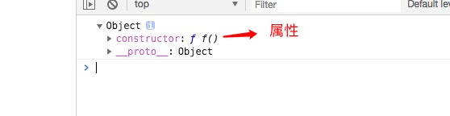
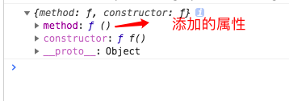

## 1.prototype:原型，每个函数都有prototype属性，默认指向的一个object空对象（即称：原型对象）
```javascript
function Foo() {
    }
    console.log(Foo.prototype)   //constructor构造函数， __proto__
```

这里为什么要说是空对象，明明看到有constructor、__proto__两个属性，其实是这个object对象中没有我们所需要的属性，当然可以去给原型中添加我们需要属性或者方法。

## 2. 给原型对象添加属性(一般都是方法)
````javascript
Foo.prototype.method=function () {
    console.log("method()")
}
console.log(Foo.prototype) 
````
此时在原型中可以看到method属性已经添加到Foo()中去。


现在我们通过创建实例去访问我们刚才添加的方法
```javascript
var fun=new Foo()
fun.method()   // 可以看到返回的是method()
```

## 3.constructor
在原型对象中有一个属性constructor，当我们自定义构造函数之后，其原型对象只会默认取得constructor值，可以通过该属性判断出实例是由哪个构造函数创建的。

```javascript
    console.log(fun.prototype.constructor===Foo)  //true
```

## __proto__
在每个实例中都有一个__proto__指针，它指向的的是构造函数的原型对象。

```javascript
var foo = new Foo();
foo.__proto__ === Foo.prototype; //true
```
那么构造函数的原型对象是由什么来创建的呢？
我们去构造函数中寻找：
```javascript
Foo.prototype.__proto__.constructor // ƒ Object() { [native code] }
```
这样一来可以看到构造函数原型链的其他方法，原来是从Object 上继承来的。


由此可以看到构造函数跟原型对象是相互引用的关系。


__
